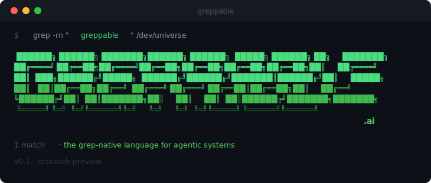

FORK CONTEXT: Modifications to work alongside [Serena](https://github.com/oraios/serena) and [MemPalace](https://github.com/MemPalace/mempalace). Strip Greppable to schema/API/diagram/doc layers only, removing GDLC and GDLM to avoid overlap with Serena (code intelligence) and MemPalace (memory). 

<p align="center">
  
</p>

<p align="center">
  <strong>v0.9.6</strong> — research preview
</p>

Greppable is a data language designed for how agents actually work — using native bash tools like `grep`. Seven grep-native file formats give your AI agents structured knowledge about your codebase, schemas, APIs, architecture, and decisions. The filesystem is the coordination layer, git is the audit trail, and `grep` is the query engine.

## Benchmarks

Tested on [n8n](https://github.com/n8n-io/n8n) v2.8.3, a production monorepo with enough complexity to exercise all three GDL formats. 16 GDL files (19,025 lines) installed alongside existing source code. 40 questions across 4 tiers, judged by Claude Sonnet 4.5.

| Metric | With GDL | Source Only | Delta |
|--------|----------|-------------|-------|
| **Overall Accuracy** | **87.4%** | 76.9% | **+10.5pp** |
| Avg Turns | 8.1 | 14.2 | 43% fewer |
| Avg Cost/Question | $0.064 | $0.105 | 39% cheaper |
| Avg Duration | 32.5s | 46.6s | 30% faster |

**Per-layer impact:**
- **GDLC** (Code Maps) — 59% fewer turns, +6.0pp accuracy
- **GDLD** (Diagrams) — 55% fewer turns, +18.7pp accuracy
- **GDLS** (Schema) — 39% fewer turns, +3.5pp accuracy

**Key findings:** Diagram questions benefit most (+18.7pp) — the control must trace execution paths through source code. Cross-format questions show strong synergy (+14.0pp) from targeted grep across structured formats. GDL doesn't trade accuracy for efficiency — it improves both.

> Full methodology and per-tier breakdowns at [greppable.ai/benchmarks](https://greppable.ai/benchmarks)

## Quick Install

```bash
# Add the Greppable marketplace (once)
/plugin marketplace add greppable/greppable-cc-plugin

# Install the plugin
/plugin install greppable@greppable-cc-plugin
```

> **Upgrading from the alpha?** The plugin moved from `greppable-plugin-alpha` to `greppable-cc-plugin` in April 2026. Existing alpha users should remove the old marketplace first:
>
> ```
> /plugin marketplace remove greppable-alpha
> /plugin marketplace add greppable/greppable-cc-plugin
> /plugin install greppable@greppable-cc-plugin
> ```
>
> GitHub redirects the old repo URL, so cached clones keep working, but the marketplace `name` field changed and needs a fresh add.

## Your First 5 Minutes

### 1. Onboard your project

```
/greppable:onboard
```

This sets up greppable for your project:
- Creates `.claude/greppable.local.md` (your config)
- Creates the `docs/gdl/` directory structure for artifacts
- Adds `.claude/*.local.md` to `.gitignore`

### 2. Discover your codebase

```
/greppable:discover
```

Scans your project and generates GDL artifacts:
- **Code index** (`.gdlc`) — file paths, exports, imports, language metadata
- **Architecture diagrams** (`.gdld`) — system flows and visual knowledge
- **Schema maps** (`.gdls`) — database tables, columns, relationships (if SQL/Prisma detected)
- **API contracts** (`.gdla`) — endpoints, schemas, auth (if OpenAPI/GraphQL detected)

### 3. Check what was created

```
/greppable:status
```

Shows your GDL health: mode, active layers, artifact counts, and any stale files.

### 4. Query across everything

```
/greppable:about authentication
/greppable:about GL_ACCOUNT --layer=gdls
/greppable:about payment --summary
```

Searches all 7 GDL layers at once. Results grouped by layer with progressive disclosure.

## Skills

| Command | What it does |
|---------|-------------|
| `/greppable:onboard` | Set up GDL config, static reference, and directory structure |
| `/greppable:discover` | Full codebase scan — generates code maps, diagrams, schemas |
| `/greppable:about` | Cross-layer search across all 7 GDL formats |
| `/greppable:diagram` | Create architecture diagrams from conversation context |
| `/greppable:status` | Health check — inventory, stale detection, lint status |
| `/greppable:pr-summary` | PR summaries with change-flow diagrams |
| `/greppable:memory` | Toggle automatic session memory extraction |
| `/greppable:ignore` | Manage .gdlignore exclusion patterns |

## The Seven Layers

| Layer | Extension | Purpose |
|-------|-----------|---------|
| **GDLS** (Schema) | `.gdls` | Structural maps of external systems (tables, columns, PKs) |
| **GDL** (Data) | `.gdl` | Structured business data as `@type\|key:value` records |
| **GDLC** (Code) | `.gdlc` | File-level code index (paths, exports, imports) |
| **GDLA** (API) | `.gdla` | API contract maps (endpoints, schemas, auth) |
| **GDLM** (Memory) | `.gdlm` | Shared agent knowledge with three-tier lifecycle |
| **GDLD** (Diagram) | `.gdld` | Visual knowledge — flows, patterns, sequences, gotchas |
| **GDLU** (Unstructured) | `.gdlu` | Document indexes for PDFs, transcripts, media |

All formats share: `@` prefix, `|` delimiter, one record per line — `grep` works across all seven layers.

## The Format

Every GDL line is a self-contained, searchable record. No nesting, no closing brackets, no indentation ambiguity. A single `grep` command can query 10,000 tables with 100% accuracy.

```
@customer|id:C-001|name:Acme Corp|tier:enterprise|region:APAC
@schema|table:orders|col:customer_id|type:FK|ref:customers.id
@D AuthService|login(email,password):AuthResult|logout():void
```

**Performance:**
- 51% smaller than YAML, 18-23% fewer tokens per query
- 100% accuracy at 10,000 tables with a single tool call
- Works with any LLM that has bash/grep access

## How It Works

Greppable uses hooks and skills to integrate automatically:
- **SessionStart** — injects artifact inventory and context into every session
- **PreToolUse** — checks `rules.gdl` and injects matching rules before file edits
- **PostToolUse** — validates GDL files with `gdl-lint.sh` after changes
- **Skills** — trigger based on what you're doing (exploring code, investigating decisions, mapping architecture)
- **Background memory** — extracts decisions and observations from sessions automatically

## Bash Tooling

Every format has matching bash tools for direct use:

```bash
# Cross-layer search
source scripts/gdl-tools.sh
gdl_about "authentication" .

# Code index
source scripts/gdlc-tools.sh
gdlc_exports parseGdls project.gdlc

# Visualization pipeline: any format → GDLD → Mermaid
bash scripts/gdlc2gdld.sh code.gdlc > /tmp/out.gdld && bash scripts/gdld2mermaid.sh /tmp/out.gdld

# Linting
bash scripts/gdl-lint.sh --all docs/gdl --strict
```

## Documentation

| Document | Description |
|----------|-------------|
| [ARCHITECTURE.md](ARCHITECTURE.md) | Core architecture, concurrency model, agent coordination |
| [specs/](specs/) | Format specifications for all 7 layers |
| [PROMPTS.md](PROMPTS.md) | Optimized minimal agent prompts per layer |

## License

MIT — see [LICENSE](LICENSE).
